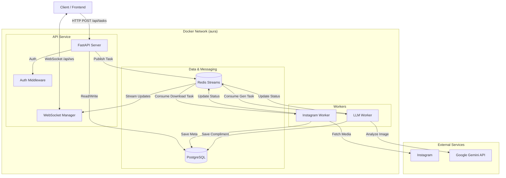

# Aura - AI-Powered Instagram Compliment Generator

Aura is an event-driven application that analyzes Instagram posts using Computer Vision and Generative AI to create personalized, styled compliments. Users can submit Instagram URLs, which the system downloads, analyzes, and transforms into witty, romantic, or poetic comments using Google's Gemini model.

## 🌟 Key Features

*   **Instagram Integration**: Automatically extracts images and metadata from Instagram posts and carousels via provided URLs.
*   **AI Vision Analysis**: Uses Google Gemini 2.5 (Multimodal) to understand image context, composition, and content.
*   **Event-Driven Architecture**: Utilizes Redis Streams for asynchronous task processing and high scalability.
*   **Real-Time Updates**: WebSocket integration provides live feedback on task status (queuing, downloading, generating).
*   **Secure Authentication**: JWT-based OAuth2 authentication with email verification and password recovery.

## 🏗 Architecture Overview

Aura is built on a **Microservices-lite**, **Event-Driven** architecture within a containerized environment. It separates the API layer from heavy background processing tasks (downloading media and querying LLMs) using Redis Streams as a message broker.

### System Components

1.  **FastAPI Backend**: Serves REST endpoints, handles authentication, and manages WebSocket connections. It acts as the producer for the Redis Streams.
2.  **PostgreSQL**: Relational database storing users, post metadata, image references, and generated compliments.
3.  **Redis**: Used for two purposes:
    *   **Message Broker**: Stores streams for task queues (`tasks:instagram_download:stream` and `tasks:compliment_generation:stream`).
    *   **Rate Limiting**: Storage for `slowapi` rate limit counters.
4.  **Worker Service (Instagram)**: A dedicated consumer that listens to the download stream, fetches content from Instagram, and stores media locally/proxied.
5.  **Worker Service (LLM)**: A dedicated consumer that sends image data to Google Gemini and processes the generative response.

### High-Level Architecture Diagram



## 🔄 Data Flow

### 1. Media Ingestion Pipeline
1.  User submits an Instagram URL to `/api/tasks/download`.
2.  API creates a `Task` (status: pending) and pushes an event to `tasks:instagram_download:stream`.
3.  **Instagram Worker** (running in background container) picks up the event.
4.  Worker uses `instaloader` to fetch image bytes and metadata.
5.  Images are stored, and references are saved to the `images` table in PostgreSQL.
6.  Task status is updated to `done` via Redis, notifying the client via WebSocket.

### 2. Compliment Generation Pipeline
1.  User requests a compliment for a specific post ID via `/api/compliments/`.
2.  API pushes an event to `tasks:compliment_generation:stream`.
3.  **LLM Worker** (running in background container) picks up the event.
4.  Worker retrieves the image from storage and sends bytes + System Prompt to Google Gemini.
5.  Gemini returns a structured JSON response containing the compliment text and a "tone breakdown".
6.  Worker saves the result to the `compliments` table and marks the task complete.

## 📂 Project Structure

The repository follows a structured layout where the backend logic is isolated in the `backend/` directory, facilitating easier deployment and potential frontend integration.

```text
.
├── .gitignore               
├── .repomixignore           
└── backend/                 
    ├── alembic.ini          
    ├── docker-compose.yml   
    ├── Dockerfile           
    ├── pyproject.toml       
    ├── requirements.txt     
    ├── scripts/             # CI/CD and Entrypoint scripts
    │   ├── prestart.sh      # DB init and migrations
    │   └── ...
    └── app/                 # Application Source Code
        ├── api/             # REST API & WebSocket Endpoints
        ├── core/            # Config, DB connection, Security
        ├── data/            # DAL (Data Access Layer) / CRUD
        ├── models/          # SQLModel Database Tables
        ├── schemas/         # Pydantic Data Transfer Objects
        ├── service/         # Business Logic
        │   ├── gemini_service/  # AI Integration
        │   └── instagram.py     # Scraper Logic
        ├── utils/           # Helpers (Email, Tokens, Time)
        ├── workers/         # Background Consumers
        │   ├── instagram_download_worker.py
        │   └── llm_worker.py
        └── main.py          # App Entrypoint
```

## 🛠 Tech Stack

| Category | Technology | Description |
|----------|------------|-------------|
| **Language** | Python 3.11 | Core logic for API and Workers |
| **Framework** | FastAPI | High-performance Async web framework |
| **Database** | PostgreSQL 15 | Primary persistent storage |
| **ORM** | SQLModel | Type-safe interaction with SQL (Pydantic + SQLAlchemy) |
| **Broker** | Redis 7 | Stream processing and Rate Limiting |
| **AI Model** | Google Gemini | Multimodal LLM for image analysis |
| **Scraping** | Instaloader | Library for extracting Instagram media |
| **Infra** | Docker Compose | Container orchestration for local dev |